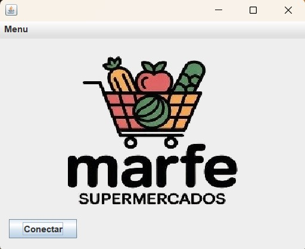

# LojaSistema

Sistema de cadastro e pesquisa de dados de uma loja, desenvolvido em Java como projeto acadêmico. Essa aplicação desktop foi construída utilizando a IDE NetBeans, com interface gráfica (Swing) e persistência de dados via banco de dados relacional.



## 🛠️ Tecnologias Utilizadas

- **Java** (versão recomendada: 8 ou superior)
- **Swing** (interface gráfica)
- **NetBeans IDE**
- **MySQL** (para persistência de dados)
- **SQL** (script incluído)

## 📁 Estrutura do Projeto

- `src/` — Código-fonte Java
- `build/` — Arquivos compilados (.class)
- `database/loja.sql` — Script de criação do banco de dados
- `assets/Midia.png` — Imagem ilustrativa da interface
- `manifest.mf` — Manifesto do projeto Java
- `build.xml` — Script de automação 

## 🚀 Como Executar o Projeto 

1. **Clone este repositório** ou baixe o ZIP:

   ```bash
   git clone https://github.com/seu-usuario/LojaSistema.git
   ```

2. **Abra o projeto no NetBeans** (recomendado):

   - Vá em `Arquivo > Abrir Projeto`
   - Selecione a pasta `LojaSistema`
   - O NetBeans detectará automaticamente o `build.xml` e configurará o projeto

3. **Configure o banco de dados**:

   - Crie um banco de dados MySQL utilizando o script localizado em `database/loja.sql`
   - Verifique e atualize os dados de conexão no código (host, usuário, senha)

4. **Compile e execute usando o Ant**:

   - No NetBeans: clique com o botão direito no projeto → **Compilar** / **Executar**
   - Ou pela linha de comando:

     ```bash
     ant clean
     ant compile
     ant run
     ```

## 📷 Captura de Tela

A imagem `assets/Imagem.jpg` mostra a interface gráfica da aplicação.

## 📌 Observações

- O projeto é voltado para fins educacionais.
- Serve como base para aprendizado em Java Desktop, banco de dados e uso do NetBeans com Apache Ant.
- Você pode estender as funcionalidades como desafio pessoal.

## 📄 Licença

Este projeto está sob a licença MIT. Sinta-se à vontade para utilizar, modificar e compartilhar, dando os devidos créditos.

---

Desenvolvido como parte do curso de Desenvolvimento de Software Multiplataforma — FATEC Araras.
